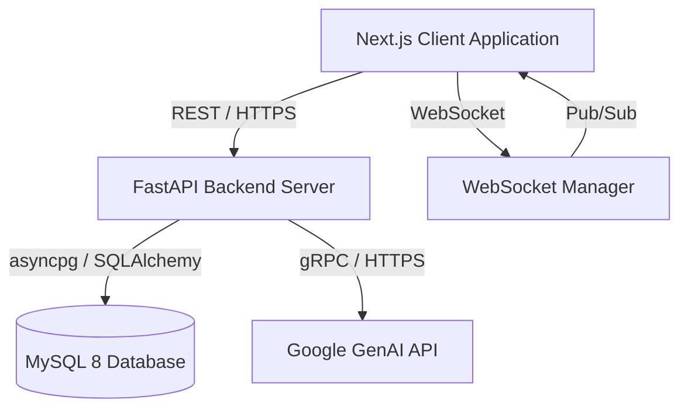

# Architecture Overview: JourneyForge

JourneyForge is built using a modern, decoupled client-server architecture designed for enterprise scalability, real-time collaboration, and maintainability.

---

## 1. High-Level Architecture

---

## 2. Technology Stack

### Frontend (Client-Side)
- **Framework:** Next.js 15 (App Router, React 19)
- **Language:** TypeScript
- **Styling:** Tailwind CSS (Custom enterprise theme with Glassmorphism)
- **State Management:** Zustand (for Auth, Journeys, Personas)
- **Drag & Drop:** `@dnd-kit/core`
- **Charts:** Recharts
- **Testing:** Vitest, React Testing Library

### Backend (Server-Side)
- **Framework:** FastAPI
- **Language:** Python 3.11+
- **ORM:** SQLAlchemy 2.0 (Async mode)
- **Database Migrations:** Alembic
- **Authentication:** PyJWT + Bcrypt (Refresh Token Rotation)
- **AI Integration:** `google-genai`
- **Testing:** Pytest, `pytest-asyncio`, `aiosqlite` (in-memory test DB)

---

## 3. Core System Components

### 3.1. Authentication & Security (RBAC)
- **Multi-Tenancy:** Users belong to a `Team`. All primary entities (Journeys, Personas, Logs) are partitioned by `team_id`.
- **JWT Flow:** The backend issues an `access_token` (15m expiry) and a `refresh_token` (7d expiry) stored in HttpOnly cookies (or secure local storage).
- **Axios Interceptors:** The frontend intercepts 401 Unauthorized responses and automatically attempts to refresh the token using the refresh endpoint before retrying the request.
- **RBAC:** Backend routes are protected by `RoleChecker` dependencies (Admin, Editor, Viewer).

### 3.2. State Management (Zustand)
- **`authStore`:** Manages the active user session and JWT tokens.
- **`journeyStore`:** Manages the state of the active journey, stages, and detail panels. It provides optimistic UI updates for drag-and-drop operations before syncing with the backend.
- **`personaStore`:** Manages the CRUD operations for buyer personas.

### 3.3. Database Schema Design
- **Users & Teams:** A Team has many Users.
- **Journeys:** A Journey belongs to a Team.
- **Stages:** A Journey has many Stages (e.g., Awareness, Consideration), ordered by an `order_index`.
- **StageItems:** A Stage has many items (Goals, Touchpoints, Content), categorized by an `item_type` enum.
- **Personas:** A Team has many Personas. Personas can be linked to Journeys via a many-to-many junction table (`JourneyPersona`).
- **Audit Logs:** Tracks actions (`created`, `updated`, `deleted`) on entities for reporting and analytics.

### 3.4. Real-Time Collaboration
- **WebSocket Manager (`collaboration_service.py`):**
  - Maintains active connections mapped by `journey_id`.
  - Broadcasts "Presence" updates so users can see who else is viewing the journey.
  - Broadcasts "Entity Updates" (e.g., when a stage is renamed or reordered) so connected clients can update their local Zustand store instantly without polling.

### 3.5. AI Integration
- The backend `AIService` constructs strictly formatted prompts based on the current context (e.g., the name of the Journey, the current Stage, and linked Personas).
- The service uses the Google Gemini API to return structured JSON suggestions that the frontend can immediately parse and insert as new Goals or Touchpoints. If the API key is missing, it falls back to a mocked generator for uninterrupted local development.
